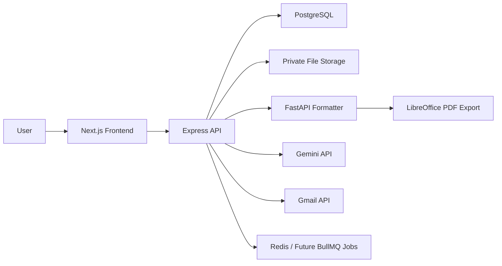

# ResumeFlow OS

ResumeFlow OS is a full-stack job application dashboard that connects job descriptions, prompt templates, AI-generated raw resumes, DOCX formatting, validation, match analysis, and application tracking in one workflow.

The MVP supports the manual resume workflow:

```text
Job Description -> Gemini Prompt -> Raw Resume DOCX -> Python Formatter -> Final Resume DOCX -> Stored Resume -> Application Tracker
```

It also includes the foundation for the automated workflow:

```text
Job Description -> Eligibility Check -> Focus Detection -> Prompt Assembly -> Gemini API -> Validation -> Formatter -> DOCX/PDF Storage -> Application Tracking
```

## Problem Statement

Applying to many roles creates scattered artifacts: job descriptions, prompts, raw AI outputs, formatted resumes, validation notes, and application statuses. ResumeFlow OS keeps those pieces connected so each generated resume can be traced back to the exact job, prompt, focus strategy, validation report, and application status.

## Features

- User registration, login, HttpOnly JWT auth, and protected routes
- Candidate profile storage for dynamic resume contact, education, and certification data
- Job description manager with status tracking, notes, eligibility checks, and JD analysis
- Prompt library with versioning, duplication, and final prompt assembly
- Resume focus templates for Java, .NET, Node.js, Golang, AI, Cloud/DevOps, Full Stack, and custom strategies
- Raw DOCX resume upload with job-linked versioning
- Python FastAPI formatter service for polished DOCX output
- Resume validator for summary, bullet count, language, AI tool, skills, bold marker, and header rules
- Resume library with filters, downloads, validation status, and match score
- Resume-to-JD match analyzer with missing skill suggestions
- PDF export through LibreOffice CLI
- Server-side Gemini API generation
- Gmail job email detection and user-confirmed status updates
- Application tracker with follow-ups, interviews, assessments, reminders, and analytics dashboard
- Security hardening for rate limits, upload validation, ownership checks, private downloads, and production JWT requirements

## Tech Stack

- Frontend: Next.js, React, TypeScript, Tailwind CSS
- Backend: Node.js, Express, TypeScript, Prisma
- Formatter: Python, FastAPI, python-docx, LibreOffice CLI
- Database: PostgreSQL
- Cache/queues: Redis-ready, BullMQ planned
- Storage: local private storage for MVP, S3/Supabase Storage planned
- Deployment-ready targets: Vercel frontend, Render/Railway/AWS backend and formatter, managed Postgres, managed Redis

## Architecture



Service details:

- `frontend`: dashboard UI
- `backend`: auth, APIs, validation, orchestration, metadata, and private downloads
- `formatter-service`: DOCX parsing/rendering and PDF conversion
- `postgres`: structured workflow data
- `redis`: future queue dependency

## Screenshots

Production screenshots should be added under `docs/screenshots` after deployment.

Recommended capture order:

1. Dashboard analytics
2. Job detail with JD analysis
3. Prompt library
4. Resume validation report
5. Resume library
6. Application tracker

See `docs/demo-flow.md` for the full demo sequence.

## Local Setup

Create your local environment file:

```bash
cp .env.example .env
```

Run infrastructure:

```bash
docker compose up postgres redis
```

Run the backend:

```bash
cd backend
npm install
npm run prisma:push
npm run dev
```

Run the frontend:

```bash
cd frontend
npm install
npm run dev
```

Run the formatter service:

```bash
cd formatter-service
python3 -m venv .venv
source .venv/bin/activate
pip install -r requirements.txt
uvicorn app.main:app --reload --port 8000
```

Health checks:

- Frontend: `http://localhost:3000`
- Backend: `http://localhost:4000/health`
- Formatter: `http://localhost:8000/health`
- PostgreSQL: `localhost:5433`
- Redis: `localhost:6380`

## Environment Variables

Core backend:

- `DATABASE_URL`
- `JWT_SECRET`
- `JWT_EXPIRES_IN`
- `BACKEND_PORT` or hosted platform `PORT`
- `FRONTEND_URL`
- `FORMATTER_SERVICE_URL`
- `REDIS_URL`
- `STORAGE_PROVIDER`
- `LOCAL_STORAGE_PATH`

Frontend:

- `NEXT_PUBLIC_API_URL`

Formatter:

- `FORMATTER_OUTPUT_DIR`
- `FORMATTER_MAX_UPLOAD_BYTES`
- `BASE_RESUME_TEMPLATE_PATH`

Optional integrations:

- `GEMINI_API_KEY`
- `GEMINI_MODEL`
- `GEMINI_API_BASE_URL`
- `GMAIL_CLIENT_ID`
- `GMAIL_CLIENT_SECRET`
- `GMAIL_REDIRECT_URI`

## API Overview

Main API groups:

- `/api/auth`: register, login, logout, current user
- `/api/candidate-profiles`: candidate profile CRUD
- `/api/jobs`: job CRUD, eligibility analysis, JD analysis
- `/api/prompts`: prompt CRUD, duplicate, assemble
- `/api/focus-templates`: resume focus template CRUD and file upload
- `/api/resumes`: raw upload, generation, validation, formatting, PDF export, downloads, match analysis
- `/api/applications`: application tracker CRUD
- `/api/reference-files` and `/api/reference-entries`: Excel reference library upload, parse, search
- `/api/gmail`: Gmail OAuth, scan, detection review
- `/api/notifications`: reminders and read state
- `/api/dashboard/summary`: analytics metrics and charts

Formatter API:

- `POST /format-resume`
- `POST /export-pdf`
- `GET /outputs/:fileName`

See `docs/api-design.md`.

## Database Schema

Core Prisma models:

- `User`
- `CandidateProfile`
- `Job`
- `PromptTemplate`
- `ResumeFocusTemplate`
- `ResumeVersion`
- `ResumeValidation`
- `ResumeMatchAnalysis`
- `Application`
- `ReferenceFile`
- `ReferenceEntry`
- `GmailIntegration`
- `JobEmail`
- `EmailDetection`
- `Notification`

See `docs/database-schema.md`.

## Formatter Service

The formatter service accepts a raw DOCX resume plus candidate profile JSON, parses the required sections, preserves bold runs, applies candidate contact and education data, and writes a formatted DOCX. PDF export uses LibreOffice or `soffice` in headless mode.

Known formatter errors include missing required sections, invalid DOCX files, missing base templates, write failures, missing LibreOffice, and conversion timeouts.

See `docs/formatter-service.md`.

## Validation Rules

The validator checks:

- Professional Summary presence and target word count
- Experience bullet counts for expected companies
- Bullet word counts
- Multiple core-language violations in one bullet
- AI tool mentions in restricted experience sections
- Skills categories, certifications, JD skill coverage, and title case
- Bold marker usage
- Candidate header, education, and experience header rules

See `docs/validation-rules.md`.

## Deployment

Deployment assets:

- `render.yaml`: backend, formatter, PostgreSQL, Redis, and persistent disks
- `frontend/vercel.json`: frontend build settings
- `docs/deployment.md`: production setup and smoke-test checklist

Minimum production steps:

1. Deploy backend, formatter, database, and Redis.
2. Set production environment variables.
3. Run `DATABASE_URL="<production-url>" npm run prisma:deploy` from `backend`.
4. Deploy `frontend` to Vercel with `NEXT_PUBLIC_API_URL`.
5. Test login, save JD, upload raw DOCX, format, download, and application tracking.

## Demo Video Flow

Suggested flow:

1. Login
2. Add job description
3. Analyze JD
4. Copy assembled prompt
5. Upload raw resume
6. Validate resume
7. Format resume
8. Download final DOCX
9. Track application status
10. Show dashboard analytics

See `docs/demo-flow.md`.

## Resume Bullet

Built ResumeFlow OS, a full-stack job application dashboard that stores job descriptions, manages prompt templates, formats AI-generated resumes using a Python DOCX engine, validates ATS rules, and tracks application status across the job search lifecycle.

## Future Improvements

- Replace local file storage with S3 or Supabase Storage and signed download URLs
- Move long-running generation, formatting, PDF export, match analysis, and Gmail scanning to BullMQ workers
- Add formal backend integration tests for auth, ownership, upload, format, and download flows
- Add screenshot automation for portfolio documentation
- Add production Gmail OAuth verification and richer email classification
- Add team support, role presets, and analytics drilldowns
