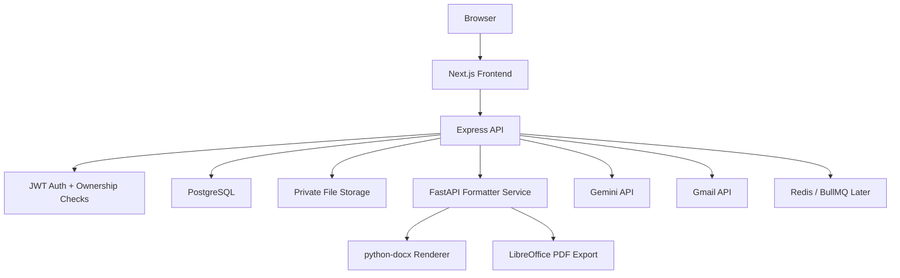
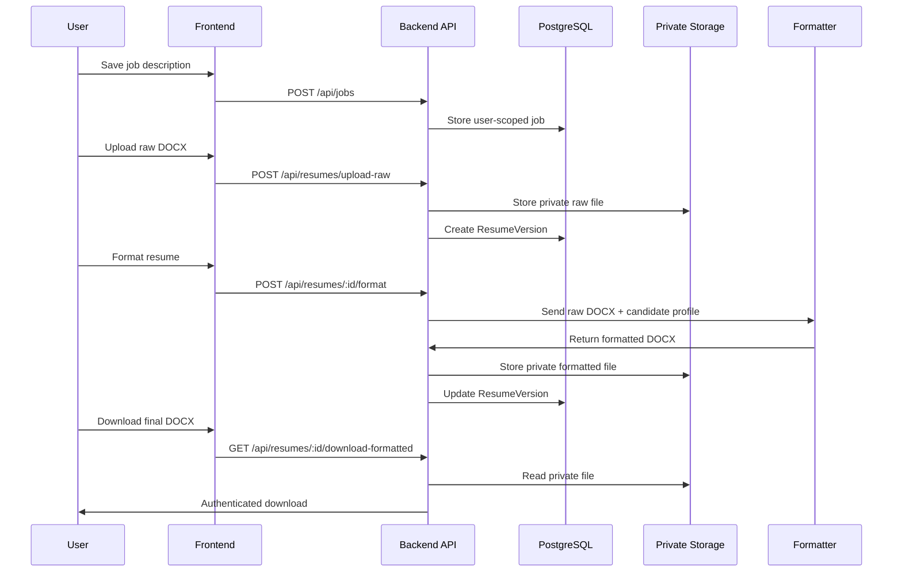

# Architecture

ResumeFlow OS is split into three application services:

- Frontend dashboard for workflow management.
- Backend API for authentication, ownership checks, records, validation orchestration, storage metadata, generation, downloads, and application tracking.
- Formatter service for DOCX formatting and PDF export.

## Data Flow

## Production Shape

- Frontend deploys independently to Vercel.
- Backend and formatter deploy as Docker web services.
- PostgreSQL stores structured workflow data.
- Redis is provisioned for future background jobs.
- MVP file storage can run on a persistent disk; S3 or Supabase Storage should replace it before horizontal scaling.
